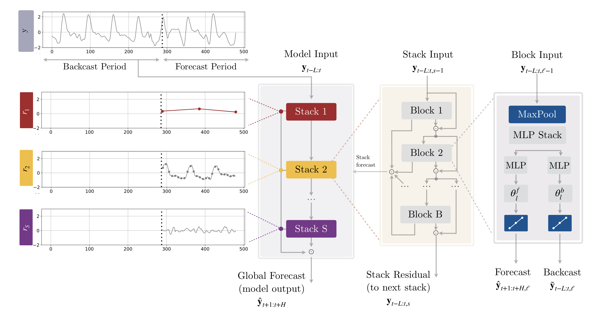

# N-HiTS: многомасштабная иерархия

[](https://colab.research.google.com/github/privettoha/neural-forecast-book/blob/main/notebooks/11_nbeats.ipynb)

## Ключевая идея

N-HiTS[^nhits] — это эволюция N-BEATS, которая решает две практические проблемы предшественника: **избыточные вычисления на длинных горизонтах** и **неспособность явно моделировать паттерны разных временных масштабов**.

Если N-BEATS заставляет каждый блок генерировать прогноз для каждой точки горизонта, то N-HiTS позволяет разным стекам работать с разной гранулярностью — один стек отвечает за долгосрочный тренд и делает редкие прогнозы, другой ловит краткосрочные колебания и делает частые.

Название расшифровывается как **N**eural **Hi**erarchical Interpolation for **T**ime **S**eries forecasting. Ключевое слово — **интерполяция**: стеки, работающие на грубом масштабе, генерируют мало точек, а промежуточные значения восстанавливаются интерполяцией.

**Результаты:** На длинных горизонтах N-HiTS в 25–50 раз быстрее N-BEATS и при этом показывает лучшее качество за счёт явного разделения низкочастотных и высокочастотных компонент[^nhits].

## Проблема N-BEATS на длинных горизонтах

Посчитаем вычислительную нагрузку N-BEATS. Горизонт $H = 168$ (неделя почасовых данных), 3 стека по 3 блока, входное окно $L = 336$ (два горизонта).

Каждый из 9 блоков генерирует:
- Backcast: 336 значений
- Forecast: 168 значений
- **Итого:** $(336 + 168) \times 9 = 4536$ выходов на forward pass

При этом все блоки решают одну и ту же задачу на одном масштабе — это избыточно.

**Вторая проблема:** Когда все блоки работают на одинаковой гранулярности, модели сложно разделить медленные тренды и быстрые осцилляции. Блок может «застрять» между попыткой уловить недельную сезонность и суточные колебания, не делая хорошо ни то, ни другое.

## Две идеи N-HiTS

N-HiTS вводит два механизма, работающих в связке:

```
┌─────────────────────────────────────────────────────────────────────┐
│                          N-HiTS                                      │
│                                                                     │
│  ВХОД                           ВЫХОД                               │
│  ─────                          ─────                               │
│  Multi-rate                     Hierarchical                        │
│  input processing               interpolation                       │
│                                                                     │
│  MaxPool сжимает вход     →     Блок генерирует мало точек    →    │
│  для каждого стека              Интерполяция до полного H          │
│                                                                     │
└─────────────────────────────────────────────────────────────────────┘
```



### 1. Multi-rate input processing

В N-BEATS каждый блок получает одно и то же окно в исходном разрешении. N-HiTS добавляет перед каждым стеком слой **MaxPool**, который агрегирует входные данные с разным шагом.

$$\mathbf{x}^{(k)} = \text{MaxPool1D}(\mathbf{x}, \text{kernel\_size}=k)$$

Длина входа для стека с kernel size $k$ становится $\lfloor L/k \rfloor$.

```
Исходный вход (L=168 часов):
[h₁, h₂, h₃, h₄, h₅, h₆, ..., h₁₆₈]

После MaxPool(kernel=1):  168 точек — полное разрешение
[h₁, h₂, h₃, h₄, h₅, h₆, ..., h₁₆₈]

После MaxPool(kernel=12): 14 точек — 12-часовые агрегаты
[max₁₋₁₂, max₁₃₋₂₄, ..., max₁₅₇₋₁₆₈]

После MaxPool(kernel=24): 7 точек — суточные агрегаты
[max₁₋₂₄, max₂₅₋₄₈, ..., max₁₄₅₋₁₆₈]
```

Это как если бы разные стеки «смотрели» на ряд с разным зумом: один видит детали, другой — общую картину.

**Почему MaxPool, а не Average?** Авторы экспериментировали с обоими вариантами. MaxPool лучше сохраняет информативные пики — важные события вроде промо-дней или аномалий не «размазываются» усреднением[^nhits].

### 2. Hierarchical interpolation

Симметричная идея для выходов. Если стек работает на грубом масштабе, ему не нужно генерировать прогноз для каждой точки. Достаточно сгенерировать меньше точек и восстановить промежуточные значения интерполяцией.

$$\hat{\mathbf{y}} = \text{Interpolate}(\hat{\mathbf{y}}^{(k)}, \text{size}=H)$$

где $\hat{\mathbf{y}}^{(k)}$ имеет длину $\lceil H/k \rceil$.

**Expressiveness ratio** — отношение длины выхода блока к полному горизонту. Стек с expressiveness ratio $1/24$ генерирует в 24 раза меньше точек, чем горизонт.

```
Горизонт H=168 часов:

Стек 1 (expressiveness ratio = 1):    168 точек
████████████████████████████████████████████████

Стек 2 (expressiveness ratio = 1/12): 14 точек → интерполяция → 168
██    ██    ██    ██    ██    ██    ██

Стек 3 (expressiveness ratio = 1/24): 7 точек → интерполяция → 168
████          ████          ████
```

## Как это работает вместе

Представим N-HiTS с тремя стеками для прогноза на неделю (168 часов):

```
┌─────────────────────────────────────────────────────────────────────┐
│ Стек 1: НИЗКОЧАСТОТНЫЙ (долгосрочный тренд)                        │
│ ─────────────────────────────────────────────                       │
│ • MaxPool kernel = 24 (суточные агрегаты на входе)                 │
│ • Expressiveness ratio = 1/24 (7 точек прогноза)                   │
│ • Задача: растут продажи к концу недели или падают?                │
│                                                                     │
│ Выход: [▪     ▪     ▪     ▪     ▪     ▪     ▪] → Interpolate → 168 │
└─────────────────────────────────────────────────────────────────────┘
                              ↓ residual
┌─────────────────────────────────────────────────────────────────────┐
│ Стек 2: СРЕДНЕЧАСТОТНЫЙ (день/ночь, будни/выходные)                │
│ ─────────────────────────────────────────────────                   │
│ • MaxPool kernel = 12 (12-часовые агрегаты)                        │
│ • Expressiveness ratio = 1/12 (14 точек прогноза)                  │
│ • Задача: различить утро и вечер                                   │
│                                                                     │
│ Выход: [▪  ▪  ▪  ▪  ▪  ▪  ▪  ▪  ▪  ▪  ▪  ▪  ▪  ▪] → Interpolate   │
└─────────────────────────────────────────────────────────────────────┘
                              ↓ residual
┌─────────────────────────────────────────────────────────────────────┐
│ Стек 3: ВЫСОКОЧАСТОТНЫЙ (часовые колебания)                        │
│ ─────────────────────────────────────────────                       │
│ • MaxPool kernel = 1 (без агрегации)                               │
│ • Expressiveness ratio = 1 (168 точек прогноза)                    │
│ • Задача: пики в обед, провалы ночью                               │
│                                                                     │
│ Выход: [▪▪▪▪▪▪▪▪▪▪▪▪▪▪▪▪▪▪▪▪▪▪▪▪▪▪▪▪▪▪▪▪▪▪▪▪▪▪▪▪▪▪...] (168 точек) │
└─────────────────────────────────────────────────────────────────────┘
                              ↓
┌─────────────────────────────────────────────────────────────────────┐
│ ФИНАЛЬНЫЙ ПРОГНОЗ = Σ Interpolate(ŷ₁) + Interpolate(ŷ₂) + ŷ₃      │
└─────────────────────────────────────────────────────────────────────┘
```

Backcast работает аналогично: каждый стек реконструирует историю на своём масштабе, остаток передаётся следующему стеку (как в N-BEATS).

## Экономия вычислений

Посчитаем выигрыш. Горизонт 168, три стека.

**N-BEATS:** Каждый стек генерирует 168 значений forecast.
$$3 \times 168 = 504 \text{ значений}$$

**N-HiTS** с expressiveness ratios 1/24, 1/12, 1:
- Стек 1: $\lceil 168/24 \rceil = 7$ значений
- Стек 2: $\lceil 168/12 \rceil = 14$ значений  
- Стек 3: $168$ значений
- **Итого:** $7 + 14 + 168 = 189$ значений

Экономия на forecast скромная (504 → 189). Но учтите:
1. **Входы тоже сжимаются** — FC-слои меньше
2. **Количество параметров** пропорционально длине входа
3. **На практике:** ускорение в 25–50× на длинных горизонтах[^nhits]

## Expressiveness ratio: интуиция

Представьте, что вы рисуете прогноз от руки:

- **Долгосрочный тренд:** Достаточно поставить несколько точек и соединить линией — промежуточные значения очевидны.
- **Краткосрочные колебания:** Нужно рисовать каждую точку, иначе потеряете детали.

Expressiveness ratio — это эта идея на языке нейросетей:
- **Низкий ratio (1/24):** «Рисуй грубо, детали не важны»
- **Высокий ratio (1):** «Рисуй точно, каждая точка имеет значение»

**Важно:** Разные масштабы не мешают друг другу. Низкочастотный стек не пытается угадать продажи в 3 часа ночи в среду — это не его работа. Он отвечает за общий уровень среды по сравнению с четвергом. Детали дорисует высокочастотный стек.

## Архитектура в деталях

Структурно N-HiTS очень похож на N-BEATS. Те же блоки с FC-слоями, тот же doubly residual stacking, та же суммация partial forecasts. Отличия локализованы в двух местах:

| Компонент | N-BEATS | N-HiTS |
|-----------|---------|--------|
| **Вход стека** | $\mathbf{x}$ как есть | $\text{MaxPool}(\mathbf{x}, k)$ |
| **Выход блока** | $\hat{\mathbf{y}} \in \mathbb{R}^H$ | $\hat{\mathbf{y}}^{(k)} \in \mathbb{R}^{\lceil H/k \rceil}$ → Interpolate |
| **Backcast** | $\hat{\mathbf{x}} \in \mathbb{R}^L$ | $\hat{\mathbf{x}}^{(k)} \in \mathbb{R}^{\lceil L/k \rceil}$ → Interpolate |

В реализации используется **линейная интерполяция** — и это осознанный выбор, подтверждённый экспериментами авторов[^nhits].

**Почему линейная, а не кубическая или nearest?** В Appendix G оригинальной статьи авторы сравнивали три варианта:
- **Nearest neighbor:** Худшие результаты — грубое «ступенчатое» восстановление
- **Linear:** Лучший баланс — гладкое восстановление без артефактов  
- **Cubic:** Сравнимо с linear, но может создавать осцилляции (эффект Рунге) на шумных данных

В `neuralforecast` доступны все три варианта через параметр `interpolation_mode`, но **linear — дефолт и рекомендация**.

## Сильные стороны

**Скорость на длинных горизонтах.** Главное преимущество. Прогноз на месяц с часовой гранулярностью (720 точек) — N-BEATS будет страдать, N-HiTS справится.

**Явное разделение масштабов.** Вместо надежды, что модель сама разберётся с многомасштабной структурой, N-HiTS явно выделяет разные частотные компоненты. Похоже на вейвлет-декомпозицию, но в learnable варианте.

**Лучшее качество на данных с богатой структурой.** На датасетах с паттернами разных масштабов (недельная + суточная сезонность + тренд) N-HiTS стабильно обходит N-BEATS[^nhits]. Это не артефакт скорости — реальное улучшение предсказательной силы.

**Совместимость с N-BEATS.** API практически идентичен. Переход — изменение нескольких строк кода.

**Масштабируемость контекста.** В главе 10 мы обсуждали, что encoder-only модели страдают от фиксированного $L$ — чем длиннее вход, тем больше параметров в FC-слоях. N-HiTS частично решает эту проблему: благодаря MaxPool, низкочастотные стеки могут «переваривать» значительно большие $L$ без взрывного роста параметров.

**Пример:** Вход $L=720$ (месяц часовых данных). Для N-BEATS первый FC-слой имел бы $720 \times 512 = 368\,640$ параметров. В N-HiTS со стеком `kernel=24` вход сжимается до $720/24 = 30$ точек, и FC-слой имеет только $30 \times 512 = 15\,360$ параметров — в 24 раза меньше. Это позволяет подавать на вход месяц истории для долгосрочного стека, не превращая модель в неповоротливого монстра.

## Ограничения

**Дополнительные гиперпараметры.** К параметрам N-BEATS добавляются kernel sizes и expressiveness ratios для каждого стека. Выбор зависит от структуры данных.

**⚠️ Опасность aliasing (наложения).** При агрессивном MaxPool (kernel=24 на 100 точках) мы рискуем потерять фазу сигнала — важные высокочастотные детали «схлопываются» в один агрегат. 

**Правило:** Всегда включайте высокочастотный стек с `kernel=1` в модель. Он работает как «страховочная сетка», подбирая все детали, пропущенные грубыми стеками из-за агрегации. В дефолтной конфигурации neuralforecast последний стек всегда имеет `kernel=1`.

**Предположение о масштабах.** N-HiTS работает лучше, когда вы заранее знаете важные масштабы. Для часовых данных с суточной сезонностью очевидно: kernels 1, 12, 24. Для нерегулярных паттернов — менее очевидно.

**Линейная интерполяция.** Может не справляться с резкими изменениями. Ступенчатые переходы (цена изменилась скачком) интерполяция «размажет».

**Унаследованные ограничения N-BEATS.** Фиксированный горизонт, отсутствие нативной поддержки ковариат, необходимость достаточного количества данных.

## Код: N-HiTS на Store Sales

```python
from neuralforecast import NeuralForecast
from neuralforecast.models import NHITS
from neuralforecast.losses.pytorch import MAE

HORIZON = 16

# Три стека с разными масштабами
model = NHITS(
    h=HORIZON,
    input_size=4 * HORIZON,  # длиннее окно для низкочастотных стеков
    loss=MAE(),
    max_steps=1000,
    
    # Ключевые параметры N-HiTS
    n_pool_kernel_size=[1, 2, 4],   # kernel sizes для MaxPool
    n_freq_downsample=[1, 2, 4],    # expressiveness ratios (обратные)
    
    # Остальное как в N-BEATS
    stack_types=['identity'] * 3,   # identity = generic
    n_blocks=[1, 1, 1],
    mlp_units=[[256, 256]] * 3,
    scaler_type='standard',
    random_seed=42
)

nf = NeuralForecast(models=[model], freq='D')
nf.fit(df=train)
forecasts = nf.predict()
```

### Подбор масштабов под данные

```python
def suggest_nhits_config(season_length: int, horizon: int, n_stacks: int = 3):
    """
    Эвристика для выбора kernel sizes и expressiveness ratios.
    
    Принцип: каждый следующий стек работает на масштабе,
    кратном сезонности или удвоении предыдущего.
    """
    kernels = [1]  # первый стек — полное разрешение
    
    current = 1
    for _ in range(n_stacks - 1):
        # Следующий масштаб: сезонность или удвоение
        if current < season_length:
            next_k = min(season_length, current * 2)
        else:
            next_k = min(current * 2, horizon)
        
        kernels.append(next_k)
        current = next_k
    
    # Expressiveness ratios = kernel sizes (симметрия вход/выход)
    return {
        'n_pool_kernel_size': kernels,
        'n_freq_downsample': kernels
    }

# Часовые данные с суточной сезонностью
config = suggest_nhits_config(season_length=24, horizon=168)
# {'n_pool_kernel_size': [1, 2, 24], 'n_freq_downsample': [1, 2, 24]}

# Дневные данные с недельной сезонностью
config = suggest_nhits_config(season_length=7, horizon=28)
# {'n_pool_kernel_size': [1, 2, 7], 'n_freq_downsample': [1, 2, 7]}
```

## Гиперпараметры

| Параметр | Типичные значения | Комментарий |
|----------|-------------------|-------------|
| `n_pool_kernel_size` | [1, season, season*2] | Должны делить L нацело |
| `n_freq_downsample` | = n_pool_kernel_size | Симметрия вход/выход |
| `input_size` | 4H — 8H | Длиннее чем для N-BEATS |
| `n_blocks` | [1, 1, 1] | Обычно 1 блок на стек достаточно |
| `mlp_units` | [[256, 256]] * n_stacks | Меньше чем N-BEATS (входы сжаты) |

**⚠️ Важно:** `input_size` должен делиться на все kernel sizes. Иначе MaxPool выдаст неожиданные размеры.

## N-HiTS vs N-BEATS: когда что выбирать

| Критерий | N-BEATS | N-HiTS |
|----------|---------|--------|
| Короткий горизонт (<30) | ✓ Достаточно | ✓ Тоже работает |
| Длинный горизонт (>100) | ✗ Медленно | ✓ Эффективно |
| Многомасштабная структура | ~ Может выучить | ✓ Явно моделирует |
| Простота настройки | ✓ Меньше параметров | ~ Нужны масштабы |
| Интерпретируемость | ✓ trend/seasonality | ~ Масштабы, не компоненты |
| Резкие изменения | ✓ Точные значения | ~ Интерполяция сглаживает |

**Практическое правило:** Начинайте с N-HiTS, если:
- Горизонт > 30 точек
- Есть очевидная многомасштабная структура (суточная + недельная сезонность)
- Важна скорость inference

## Выводы

1. **N-HiTS = N-BEATS + multi-rate processing + hierarchical interpolation.** Две простые идеи дают 25-50× ускорение.

2. **Ключевой механизм:** Разные стеки работают на разных масштабах. Низкочастотный стек видит «общую картину», высокочастотный — детали.

3. **Главное преимущество:** Эффективность на длинных горизонтах без потери качества.

4. **Главное ограничение:** Нужно знать важные масштабы заранее. Для регулярных данных с известной сезонностью — не проблема.

5. **Практика:** Используйте kernel sizes, кратные сезонности данных.

В следующей главе рассмотрим TSMixer — MLP-архитектуру от Google, которая работает с многомерными рядами и явно моделирует зависимости между каналами.

---

## Ссылки

[^nhits]: Challu, C., Olivares, K. G., Oreshkin, B. N., Garza, F., Mergenthaler-Canseco, M., & Dubrawski, A. (2023). N-HiTS: Neural Hierarchical Interpolation for Time Series Forecasting. *AAAI 2023*. https://arxiv.org/abs/2201.12886

[^nbeats]: Oreshkin, B. N., et al. (2020). N-BEATS: Neural basis expansion analysis for interpretable time series forecasting. *ICLR 2020*. https://arxiv.org/abs/1905.10437